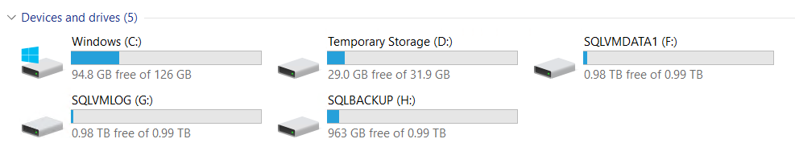
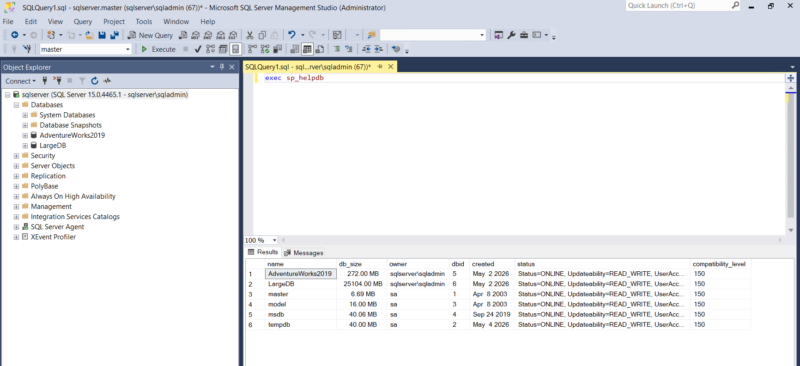
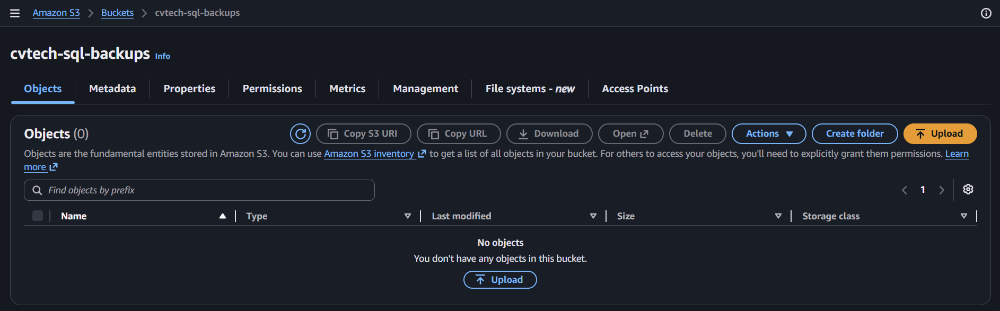

# 01 - Environment Preparation

This document outlines the initial setup required to build the **CVT BackupBridge** lab environment. The goal is to simulate an on-premises SQL Server workload and prepare AWS cloud storage for offsite backup protection.

> [!CAUTION]
> **Cloud Account & Cost Warning**
> *   **Free Tier:** It is highly recommended to use **Azure Free Account** and **AWS Free Tier** when following these procedures.
> *   **Budget Limits:** Set up **Budget Alerts** and **Cost Limits** in both Azure and AWS billing consoles immediately upon account creation to prevent unexpected charges.
> *   **Liability Disclaimer:** The author is not responsible or liable for any expenses, charges, or financial costs incurred in your cloud accounts while following this guide. You are solely responsible for monitoring your own cloud consumption and costs.

---

## Table of Contents
1. [Objective](#objective)
2. [Solution Components](#solution-components)
3. [Step 1 - Build Azure SQL Server VM](#step-1---build-azure-sql-server-vm)
4. [Step 2 - Create Dedicated Backup Storage](#step-2---create-dedicated-backup-storage)
5. [Step 3 - Create Test Databases](#step-3---create-test-databases)
6. [Step 4 - Prepare AWS S3 Bucket](#step-4---prepare-aws-s3-bucket)
7. [Step 5 - Create IAM User for Script Access](#step-5---create-iam-user-for-script-access)
8. [Validation Checklist](#validation-checklist)

---

## Objective

Prepare the following components:
*   SQL Server host environment
*   Test databases (including scaling simulation)
*   Dedicated local backup storage
*   AWS S3 bucket
*   IAM access for automation scripts

---

## Solution Components

### Simulated On-Premises SQL Server
The "on-premises" environment is hosted on an Azure Virtual Machine to simulate a remote corporate data center.

**Platform Details:**
*   **Provider:** Microsoft Azure
*   **OS:** Windows Server 2019
*   **Database:** SQL Server 2019 Developer Edition

> [!NOTE]
> While this lab uses Azure, you can also simulate the "on-premises" environment using a local virtual machine (Oracle VirtualBox, VMware), a local workstation, or even a dedicated physical server. The BackupBridge logic remains identical regardless of the underlying hardware.

---

## Step 1 - Build Azure SQL Server VM

Provision a Windows Server virtual machine in Azure.

> [!TIP]
> Use the **"SQL Server 2019 on Windows Server 2019"** image from the Azure Marketplace to save time. It comes with SQL Server and SSMS pre-installed.

### Recommended Baseline Configuration
*   **Compute:** Minimum 2 vCPU / 8 GB RAM
*   **Storage:** Premium SSD (for consistent IOPS)
*   **Security:** RDP enabled (restricted to your client IP)

### Post-Installation Tasks
1.  Install **SQL Server Management Studio (SSMS)** if not using a pre-configured image.
2.  Verify local connectivity to the SQL instance.
3.  **Update:** Run Windows Update and install the latest SQL Server Cumulative Updates (CU).

---

## Step 2 - Create Dedicated Backup Storage

*Figure 1: Dedicated multi-disk configuration in Azure for SQL Server I/O separation.*

Create a separate volume or drive dedicated exclusively for SQL backup files.

### Configuration

To follow production best practices and ensure optimal performance, the lab environment utilizes a multi-disk architecture to separate I/O workloads:

*   **Drive C:** Operating System (OS) and SQL Server Binaries.
*   **Drive F:** SQL Data Files (`F:\Data`).
*   **Drive G:** SQL Log Files (`G:\Logs`).
*   **Drive T:** TempDB (Dedicated high-speed storage for temporary objects).
*   **Drive H:** Dedicated Backup Storage (`H:\SQLBackups`).

**Backup Storage Details:**
*   **Path:** `H:\SQLBackups`
*   **Recommended Size:** 500 GB to 1 TB (to accommodate LargeDB and enterprise-scale backup files).

> [!IMPORTANT]
> In Azure, you must attach a **Data Disk** to the VM. Once attached, use `diskmgmt.msc` (Disk Management) to initialize the disk, create a simple volume, and format it as NTFS.

### Why This Matters
*   **Separation of Concerns:** Keeps the OS drive clean and prevents it from filling up during large backup operations.
*   **Performance:** Spreads I/O load across multiple physical/virtual disks.
*   **Automation:** Provides a static, predictable path for PowerShell scripts.

---

## Step 3 - Create Test Databases

### A. Initial Database Setup
Create sample databases to validate backup and restore operations.
*   **Option 1:** Restore the [AdventureWorks](https://learn.microsoft.com/en-us/sql/samples/adventureworks-install-configure) sample database.
*   **Option 2:** Create a new empty database (e.g., `LargeDB`).

### B. Simulating Enterprise Scale (LargeDB)
To benchmark upload/download speeds and bridge performance, we simulate a larger footprint.

1.  **Grow the Database:** Use the provided simulation scripts to insert records and increase file size.
    *   `Scripts/SQL/Increase_logsize_simulator.sql`
    *   `Scripts/SQL/AutoGrow_DBsize.sql`
2.  **Testing Goals:**
    *   Validate **Backup Duration**.
    *   Measure **S3 Transfer Performance**.
    *   Benchmark **Disaster Recovery (DR) Restore Timing**.

*Figure 2: Test databases (AdventureWorks and LargeDB) successfully initialized in SSMS.*

---

## Step 4 - Prepare AWS S3 Bucket

Create an Amazon S3 bucket to serve as the offsite "vault."

> [!NOTE]
> Bucket creation is a straightforward process: enter the bucket name and leave the remaining settings as default.

### Setup Guide
*   **Bucket Name:** e.g., `cvtech-sql-backups`
*   **Access:** Block all public access (Default).
*   **Versioning:** Optional (useful for ransomware protection).

### S3 Bucket Naming Requirements
*   **Length:** 3 to 63 characters.
*   **Characters:** Lowercase letters, numbers, dots (.), and hyphens (-) only.
*   **Start/End:** Must begin and end with a letter or number.
*   **Uniqueness:** Must be globally unique across all AWS accounts.

*Figure 3: AWS S3 bucket successfully created for offsite backup storage.*

---

## Step 5 - Create IAM User for Script Access

This step ensures the automation scripts can communicate with AWS securely using the **Principle of Least Privilege**. We will create a custom policy and a dedicated user with **Programmatic Access** only (no console login).

### A. Create the Scoped IAM Policy
1.  Navigate to **IAM > Policies** in the AWS Console.
2.  Click **Create policy** and select the **JSON** tab.
3.  Copy and paste the content from `Scripts/cvt-s3-policy.json`.
    *   *Note: Ensure you have updated the bucket name placeholder in the JSON to match your actual bucket.*
4.  Click **Next: Tags** > **Next: Review**.
5.  Name the policy `CVT-BackupBridge-Policy` and click **Create policy**.

### B. Create the Programmatic IAM User
1.  Navigate to **IAM > Users** and click **Create user**.
2.  **User details:** Name the user `cvt-backup-service`.
3.  **Set permissions:**
    *   Select **Attach policies directly**.
    *   Search for and select the `CVT-BackupBridge-Policy` you just created.
4.  **Review and create:** Click **Create user**.

### C. Generate Access Keys
1.  Select the newly created `cvt-backup-service` user.
2.  Go to the **Security credentials** tab.
3.  Scroll down to **Access keys** and click **Create access key**.
4.  Select **Command Line Interface (CLI)** as the use case.
5.  **Retrieve Keys:** Copy the **Access Key ID** and **Secret Access Key**.

> [!IMPORTANT]
> **Programmatic Access vs. Console Access:**
> By default, this user has no password and cannot log in to the AWS Management Console website. It can only interact with AWS via the CLI or PowerShell using the Access Keys. This significantly reduces the attack surface.

> [!WARNING]
> **NEVER** commit your AWS Access Keys or Secrets to source control. Use environment variables or a secure local credential store on your SQL VM.

---

## Validation Checklist

Before moving to the next phase, ensure:
- [ ] Azure VM is accessible via RDP.
- [ ] SQL Server instance is responsive.
- [ ] Test databases (`AdventureWorks`/`LargeDB`) are online.
- [ ] Dedicated `H:\SQLBackups` drive is formatted and ready.
- [ ] AWS S3 bucket is created and private.
- [ ] IAM User has been created with the correct policy applied.

---

## Output of This Phase

You now have a fully functional "On-Premises" SQL environment and a secure Cloud Storage target. You are ready to automate the bridge.

**Next Step:** [02 - Backup Generation](02-backup-generation.md)
