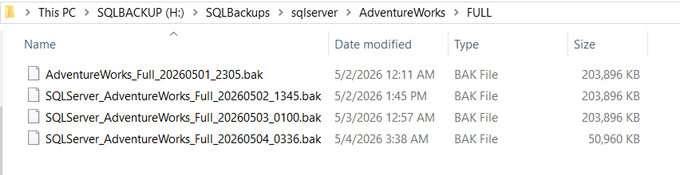

# 02 - Local Backup Storage

This document outlines the organization and management of the local backup repository. Proper storage structure is critical for the automation scripts to correctly identify, validate, and synchronize files to the cloud.

---

## Table of Contents
1. [Objective](#objective)
2. [Directory Structure](#directory-structure)
3. [Naming Conventions](#naming-conventions)
4. [Security and Permissions](#security-and-permissions)
5. [Storage Maintenance](#storage-maintenance)
6. [Next Step](#next-step)

---

## Objective

The objective of this phase is to:
*   Organize backup files into a predictable folder hierarchy.
*   Implement a naming convention that supports automated sorting and cleanup.
*   Secure the backup files against unauthorized access.

---

## Directory Structure

A standardized directory structure ensures that PowerShell automation scripts (Uploader/Downloader) can find files without complex searching. The lab uses a hierarchy that also scales to multiple servers and databases; production suitability still depends on capacity, permissions, monitoring, and tested retention.

### Recommended Layout
```text
H:\SQLBackups\
└───{ServerName}\
    └───{DatabaseName}\
        ├───FULL\           (Weekly/Daily full backups)
        ├───DIFF\           (Daily/Intra-day diff backups)
        └───LOG\            (Transaction log backups)
```

By separating backups by server, database, and type, we reduce the complexity of the S3 synchronization logic and make manual recovery significantly faster in large environments.

---

## Naming Conventions

Consistent naming improves operations and uniqueness. Restore-chain selection must use SQL backup metadata rather than filenames alone.

### Pattern
`SQLServer_{DatabaseName}_{BackupType}_{YYYYMMDD_HHMM}.{Extension}`

### Examples
*   **Full:** `SQLServer_AdventureWorks2019_Full_20260504_0336.bak`
*   **Diff:** `SQLServer_AdventureWorks2019_Diff_20260504_1000.bak`
*   **Log:** `SQLServer_AdventureWorks2019_Log_20260504_1015.trn`

---

## Security and Permissions

Backup files contain sensitive data and must be protected.

### File System Permissions (NTFS)
*   **SQL Server Service Account:** Full Control (Required to write backups).
*   **Backup transfer service identity:** Read access for upload. Grant local deletion only to a separately approved local-retention process; the uploader does not delete files.
*   **Administrators:** Full Control.
*   **Everyone/Users:** No Access.

> [!IMPORTANT]
> Ensure that the SQL Server service account has explicit write permissions to the `H:\SQLBackups` directory. Without this, backup jobs will fail with "Access Denied."

---

## Storage Maintenance

Local storage is a transient "staging area" rather than long-term storage.

*   **Capacity Monitoring:** SQL Server Agent alerts should be configured for low disk space on the `H:` drive.
*   **Cleanup ownership:** `S3_Uploader.ps1` does not purge local files. Use a separate, chain-aware local-retention job only after transfer, object/version, checksum/manifest, and SQL verification gates are satisfied.
*   **Cloud retention:** S3 Lifecycle manages cloud transitions and expiration. Never use `aws s3 sync --delete` as a retention mechanism.
*   **Retention separation:** Local staging retention is short and operational; S3 retention is longer and policy-driven. See [the retention model](11-backup-retention-model.md).



*Figure 1: Verified backup files stored in the dedicated H:\SQLBackups directory.*

---

## Next Step

With the local storage organized, proceed to the backup generation phase:

[03 - Backup Generation](03-backup-generation.md)
