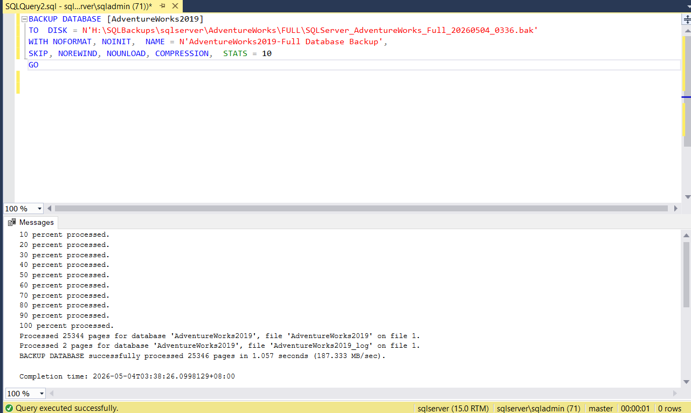

# 03 - Backup Generation

This document details the SQL Server backup strategy and implementation for the CVT BackupBridge project. The goal is to establish a reliable local backup routine that serves as the source for cloud synchronization.

---

## Table of Contents
1. [Objective](#objective)
2. [Recovery Model Configuration](#recovery-model-configuration)
3. [Backup Strategy Overview](#backup-strategy-overview)
4. [T-SQL Implementation](#t-sql-implementation)
5. [Local Retention Policy](#local-retention-policy)
6. [Next Step](#next-step)

---

## Objective

The objective of this phase is to:
*   Ensure databases are configured for point-in-time recovery.
*   Implement a multi-tier backup strategy (Full, Differential, and Log).
*   Standardize backup file naming and storage locations for automation.

---

## Recovery Model Configuration

To support transaction log backups and point-in-time recovery, databases must be set to the **FULL** recovery model.

### SQL Command
```sql
USE [master];
GO
ALTER DATABASE [AdventureWorks2019] SET RECOVERY FULL;
ALTER DATABASE [LargeDB] SET RECOVERY FULL;
GO
```

> [!NOTE]
> Databases in `SIMPLE` recovery model do not support transaction log backups. If your database is in `SIMPLE`, you will only be able to perform Full and Differential backups.

---

## Backup Strategy Overview

CVT BackupBridge utilizes a standard three-tier backup approach:

| Backup Type | Frequency | Purpose |
| :--- | :--- | :--- |
| **Full** | Weekly / Daily | Complete copy of the database. Base for all subsequent backups. |
| **Differential** | Daily / Every 4-12 hours | Captures changes since the last Full backup. Speeds up recovery. |
| **Log** | Every 15-60 minutes | Captures transaction log changes. Enables point-in-time recovery. |

---

## T-SQL Implementation

All backups are directed to the dedicated storage initialized in Phase 02: `H:\SQLBackups`.

> [!TIP]
> **Cost & Performance Optimization**
> Always use the `COMPRESSION` flag in your backup commands. Compressed backups are significantly smaller, which leads to:
> 1.  **Lower Storage Costs:** Reduced footprint in both local storage and AWS S3.
> 2.  **Faster Uploads:** Smaller files transfer to the cloud much more quickly.
> 3.  **Reduced I/O:** Faster backup completion times on the SQL Server host.

### 1. Full Backup
```sql
BACKUP DATABASE [AdventureWorks2019]
TO DISK = N'H:\SQLBackups\sqlserver\AdventureWorks\FULL\SQLServer_AdventureWorks_Full_20260504_0336.bak'
WITH NOFORMAT, NOINIT, NAME = N'AdventureWorks2019-Full Database Backup', 
SKIP, NOREWIND, NOUNLOAD, COMPRESSION, STATS = 10;
GO
```

### 2. Differential Backup
```sql
BACKUP DATABASE [AdventureWorks2019]
TO DISK = N'H:\SQLBackups\sqlserver\AdventureWorks\DIFF\SQLServer_AdventureWorks_Diff_20260504_1000.bak'
WITH DIFFERENTIAL, NOFORMAT, NOINIT, NAME = N'AdventureWorks2019-Diff Database Backup', 
SKIP, NOREWIND, NOUNLOAD, COMPRESSION, STATS = 10;
GO
```

### 3. Transaction Log Backup
```sql
BACKUP LOG [AdventureWorks2019]
TO DISK = N'H:\SQLBackups\sqlserver\AdventureWorks\LOG\SQLServer_AdventureWorks_Log_20260504_1015.trn'
WITH NOFORMAT, NOINIT, NAME = N'AdventureWorks2019-Log Database Backup', 
SKIP, NOREWIND, NOUNLOAD, COMPRESSION, STATS = 10;
GO
```


*Figure 1: Successful execution of a compressed Full Backup in SSMS.*

> [!TIP]
> **Ad-hoc Backups:** If you need to take a manual backup without affecting the existing backup sequence or log chain, use the `COPY_ONLY` option.

---

## SQL Server Agent Automation

In a production environment, backups must be automated using **SQL Server Agent Jobs**.

### Recommended Job Configuration:
1.  **Full Backup Job:** Runs weekly (e.g., Sunday at 12:00 AM).
2.  **Differential Job:** Runs daily (e.g., Daily at 10:00 PM).
3.  **Log Backup Job:** Runs frequently (e.g., every 15 or 30 minutes).

### Automation Strategy:
Each job should contain a T-SQL step with the commands provided above. Ensure that the SQL Server Agent service account has **Full Control** permissions on the `H:\SQLBackups` directory.

> [!NOTE]
> **Future Upgrade:** Automated SQL Server Agent Jobs are not yet implemented in the current lab environment. For now, backups are generated manually using the provided T-SQL scripts. Automation is planned for a future project phase.

---

## Local Retention Policy

To prevent the local `H:\SQLBackups` drive from reaching capacity, a retention policy is required.

*   **Policy:** Maintain 24-48 hours of local backups.
*   **Cleanup:** Older files are deleted locally after successful confirmation of the S3 upload.

---

## Next Step

Once local backups are generated successfully, proceed to:

[04 - Upload to S3](04-upload-to-s3.md)
