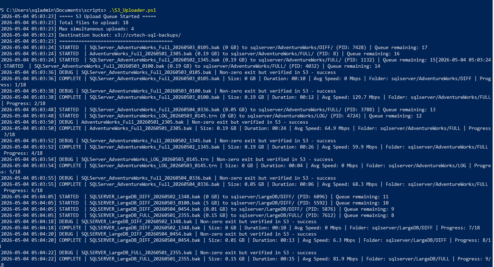
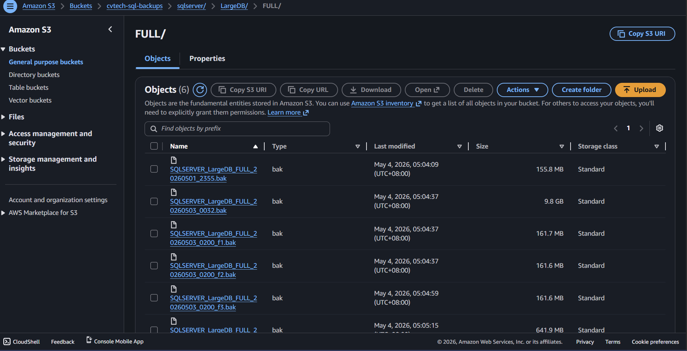

# 04 - Upload to S3

This document describes the synchronization process that bridges local SQL Server backups to AWS S3. This automation ensures that offsite protection is maintained without manual intervention.

---

## Table of Contents
1. [Objective](#objective)
2. [Script Overview (S3_Uploader.ps1)](#script-overview-s3_uploaderps1)
3. [Mapped Network Drive & UNC Support](#mapped-network-drive--unc-support)
4. [Prerequisites](#prerequisites)
5. [Script Installation](#script-installation)
6. [Implementation Logic](#implementation-logic)
7. [Automation and Scheduling](#automation-and-scheduling)
8. [Next Step](#next-step)

---

## Objective

The objective of this phase is to:
*   Automate the transfer of local backup files to AWS S3.
*   Ensure secure handling of AWS credentials.
*   Implement verification and local cleanup to manage disk space.

---

## Script Overview (S3_Uploader.ps1)

The synchronization is powered by the `S3_Uploader.ps1` script, a high-performance, multi-threaded automation engine designed to bridge on-premises backups to AWS S3.

### Key Technical Features
*   **Multi-Threaded Concurrent Uploads:** Utilizes a background job queue to process multiple files simultaneously (Max: 4 concurrent streams by default). This ensures maximum saturation of available network bandwidth.
*   **Intelligent Folder Mapping:** Automatically parses the local hierarchy and recreates a matching `{ServerName}/{DatabaseName}/{Type}` prefix structure in the S3 bucket.
*   **Dual-Validation Success Logic:** Implements a robust "Trust but Verify" approach. If the AWS CLI returns a non-zero exit code, the script automatically performs an `aws s3 ls` verification. If the object exists in S3, it is marked as a success, preventing redundant and time-consuming retries.
*   **Mapped Network Drive & UNC Support:** Automatically resolves mapped drives (e.g., `Z:\`) to their original network share name (e.g., `SQL1Test`). It also natively supports direct UNC paths for enhanced reliability in "Run as Administrator" or service account contexts.
*   **Legacy Compatibility:** Optimized for PowerShell 2.0+, ensuring compatibility with older Windows Server environments (WS 2008 R2 / 2012).
*   **Fault Tolerance (Automatic Retries):** Implements a retry mechanism that only triggers if both the process exit code AND the S3 verification fail, ensuring maximum efficiency.

---

## Mapped Network Drive & UNC Support

The `S3_Uploader.ps1` script is optimized for enterprise environments where backups are stored on deep network hierarchies or specialized storage appliances.

### Handling Mapped Drives (e.g., Z:\)
While the script can resolve mapped drives, **mapped drives are user-session specific**. They may not be visible to "Administrator" sessions or scheduled tasks.

### UNC Paths (Recommended Strategy)
For maximum reliability, it is recommended to use direct **UNC Paths** in `settings.json`. This ensures the script can access the backup source regardless of user session or administrator elevation.

*   **UNC Configuration:**
    ```json
    "BackupRootPath": "\\\\NetworkPath\\Backups\\ServerName"
    ```
*   **S3 Result:** The script automatically identifies `ServerName` as the leaf and uses it as the S3 root. Objects will be stored as `s3://bucket/ServerName/Database/file.bak`.

---

## Prerequisites

Before running the synchronization script, ensure the following are configured on the Azure SQL VM:

1.  **AWS CLI v2:** Installed and configured with the `cvt-backup-service` credentials.
2.  **IAM Credentials:** Programmatic access keys generated in Phase 01.
3.  **Connectivity:** Outbound HTTPS (Port 443) access to AWS S3 endpoints.

---

## Script Installation

1.  **Download:** Download the `S3_Uploader.ps1` script from the `Scripts/powershell/` directory and the `settings.json.template` from the `Scripts/` directory.
2.  **Placement:** Save the script and template to your automation folder (e.g., `C:\Scripts\`).
3.  **Configuration:** 
    *   Copy `settings.json.template` to the `Scripts/` folder as `settings.json`.
    *   Update the `settings.json` file with your environment details:
        *   `S3Bucket`: Your S3 bucket name (e.g., `s3://cvtech-sql-backups`).
        *   `AWSRegion`: Your AWS region (e.g., `ap-southeast-1`).
        *   `MaxSimultaneousJobs`: Concurrency limit (default is 4).
        *   `BackupRootPath`: Path to your local backup drive (e.g., `H:\\SQLBackups`).
        *   `LogDirectory`: Folder where log files will be stored (e.g., `C:\\Logs`).

---

## Implementation Logic

The uploader follows a thorough workflow for secure cloud synchronization. It is recommended to perform a manual run before automating the task.

### Step-by-Step Workflow
1.  **Object Discovery:** Recursively scans `H:\SQLBackups` for `.bak` and `.trn` files.
2.  **Queue Initialization:** Builds a processing queue with file metadata and size calculations.
3.  **Parallel Execution:** Spawns `aws s3 cp` processes up to the defined concurrency limit.
4.  **Verification:** Validates upload integrity using process exit codes and S3 object listing.
5.  **Manual Execution (Test Run):** Open PowerShell as Administrator and execute the script to verify connectivity and logic:
    ```powershell
    Set-Location "C:\Scripts\"
    .\S3_Uploader.ps1
    ```


*Figure 1: S3 Multi-Threaded Uploader in action, showing parallel transfers and real-time Mbps telemetry.*


*Figure 2: The S3 bucket "vault" showing the successfully synchronized backup hierarchy.*

6.  **Logging:** Records detailed telemetry to a central `.log` file for audit and troubleshooting.

---

## Automation and Scheduling

To achieve a true "Bridge" experience, the uploader should run on a schedule.

### Option 1: SQL Server Agent (Recommended)
*   **Type:** PowerShell Step.
*   **Frequency:** Scheduled to run immediately after the SQL Backup jobs complete.
*   **Benefit:** Centralized management within SSMS and integration with database alerts.

### Option 2: Windows Task Scheduler
*   **Frequency:** Every 15-30 minutes.
*   **Trigger:** Repeat task indefinitely.
*   **Action:** `powershell.exe -ExecutionPolicy Bypass -File "C:\Path\To\Scripts\S3_Uploader.ps1"`

> [!WARNING]
> Ensure the service account running the scheduled task has **Modify** permissions on the `H:\SQLBackups` folder and access to the AWS credential store.

---

## Output of This Phase

Your on-premises SQL Server backups are now automatically and securely replicated to the AWS cloud.

**Next Step:** [05 - Recovery Download](05-recovery-download.md)
