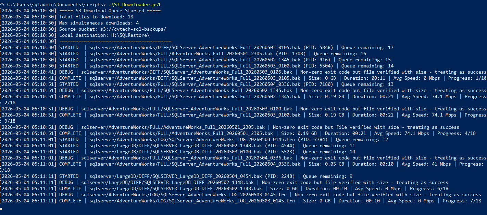
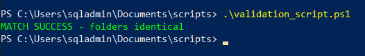

# 05 - Recovery Download

This document details the process for retrieving SQL Server backup files from AWS S3 for restoration. In a disaster recovery (DR) scenario, the speed and reliability of this "Inbound" bridge are critical.

---

## Table of Contents
1. [Objective](#objective)
2. [Script Overview (S3_Downloader.ps1)](#script-overview-s3_downloaderps1)
3. [Prerequisites](#prerequisites)
4. [Target Staging Area](#target-staging-area)
5. [Implementation Logic](#implementation-logic)
6. [Next Step](#next-step)

---

## Objective

The objective of this phase is to:
*   Securely retrieve backup files from the offsite cloud vault.
*   Maximize download throughput using multi-threaded execution.
*   Stage the files in a dedicated restore directory for SQL Server consumption.

---

## Script Overview (S3_Downloader.ps1)

The retrieval process is powered by `S3_Downloader.ps1`, a robust PowerShell script designed for high-volume data transfers.

### Key Features
*   **Multi-Threaded Processing:** Downloads multiple files simultaneously to saturate available network bandwidth.
*   **Recursive Discovery:** Automatically identifies the directory structure in S3 (Full, Diff, Logs) and recreates it locally.
*   **Automatic Retries:** Implements a retry mechanism (default: 3 attempts) for transient network failures.
*   **Comprehensive Logging:** Tracks performance metrics, including transfer speeds (Mbps) and durations.

---

## Prerequisites

To perform a recovery download, the following must be in place:

1.  **AWS CLI:** Installed and configured on the recovery server.
2.  **IAM Permissions:** The IAM user must have `s3:GetObject` and `s3:ListBucket` permissions (as defined in `cvt-s3-policy.json`).
3.  **Local Storage:** Sufficient disk space on the recovery volume to hold the downloaded backup files.

---

## Target Staging Area

Files should be downloaded to a dedicated volume to avoid contention with the production SQL Server data files.

### Example
`H:\SQLRestore`

### Directory Layout (After Download)
```text
H:\SQLRestore\
└───{ServerName}\
    └───{DatabaseName}\
        ├───FULL\
        ├───DIFF\
        └───LOG\
```

> [!NOTE]
> By maintaining the same directory structure as the local backup storage, the restoration scripts can easily identify the sequence of files required for a point-in-time recovery.

---

## Implementation Logic

The downloader executes the following steps:

1.  **Object Discovery:** Recursively lists all objects in the specified S3 bucket.
2.  **Queue Initialization:** Builds a local directory structure matching the S3 hierarchy.
3.  **Parallel Execution:** Spawns background processes (using `Start-Process`) to execute `aws s3 cp` commands concurrently.
4.  **Monitoring:** Continuously polls active jobs and reaps completed ones, logging speed and progress.
5.  **Final Verification:** Confirms that all files are present and have non-zero lengths before exiting.
6.  **Manual Execution (Test Run):** Ensure your `settings.json` is configured with the correct `RestoreRootPath`. Open PowerShell as Administrator and execute the script:
    ```powershell
    Set-Location "C:\Scripts\powershell\"
    .\S3_Downloader.ps1
    ```



*Figure 1: S3 Multi-Threaded Downloader retrieving backup sets with preserved folder hierarchy.*

### Folder Placement and Pathing
The script downloads backup files to the path defined in the `RestoreRootPath` variable within `settings.json`. To maintain recovery consistency, it automatically recreates the source folder structure (e.g., `{ServerName}/{DatabaseName}/{BackupType}`) at the destination, ensuring the recovery environment mirrors the original production layout.

7.  **Integrity Validation:** Once the download is complete, verify that the restored folder structure and file sizes match the original production source.
    ```powershell
    Set-Location "C:\Scripts\powershell\"
    .\validation_script.ps1
    ```



*Figure 2: Validation script output confirming a 100% match between the source backup and the restored target.*

### Validation Script Logic
The `validation_script.ps1` performs a recursive comparison between the source (`BackupRootPath`) and the target (`RestoreRootPath`) directories defined in `settings.json`. It calculates relative paths for every file and compares them alongside their exact file sizes (in bytes). This ensures that no files were corrupted, truncated, or missed during the multi-threaded S3 transfer process.

---

## Next Step

With the backup files staged locally, the final phase is to perform the SQL Server restoration and validate data integrity:

[06 - Restore Validation](06-restore-validation.md)
