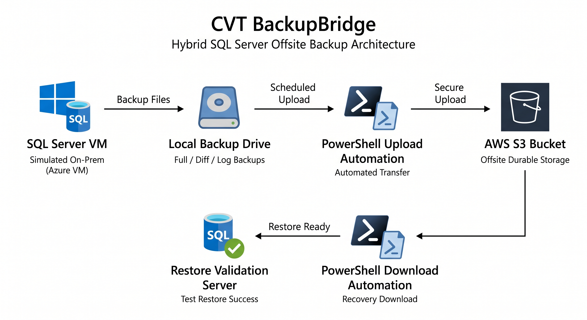

Portfolio Project | SQL Server DBA | AWS S3 | PowerShell Automation | Hybrid Cloud Disaster Recovery

# CVT BackupBridge

Hybrid SQL Server backup and recovery solution that uploads on-premises SQL Server backups to AWS S3 for secure offsite disaster recovery storage.

---

## Table of Contents

- [Problem Statement](#problem-statement)
- [Solution Overview](#solution-overview)
- [Architecture](#architecture)
- [Lab Environment](#lab-environment)
- [BackupBridge Workflow](#backupbridge-workflow)
- [Tools Used](#tools-used)
- [Results](#results)
- [Key Benefits for Companies](#key-benefits-for-companies)
- [Lessons Learned](#lessons-learned)
- [Operational Considerations](#operational-considerations)
- [Future Enhancements](#future-enhancements)
- [Author](#author)

---

## Problem Statement

Many companies still run critical SQL Server workloads on-premises and store database backups locally through file shares, SMB storage, NAS devices, tapes, or internal backup servers.

While this provides local backup capability, it also creates a major risk:

* Hardware failure
* Disk corruption
* Ransomware attacks
* Backup server compromise
* Site disasters
* Human error

If both production data and local backups are affected, recovery becomes difficult or impossible.

This project demonstrates how organizations can maintain their existing on-premises environment while adding a reliable offsite backup layer using AWS S3.

AWS S3 provides high durability (11 nines), making it a strong platform for backup retention.

---

## Solution Overview

This Proof of Concept simulates an on-premises SQL Server environment hosted on an Azure Virtual Machine and integrates backup storage with AWS S3.

The solution enables:

* SQL Server Full backups
* Differential backups
* Transaction Log backups
* Automated upload to AWS S3
* Download backups from S3 when recovery is needed
* Restore validation testing

---

## Architecture

The recovery workflow is modular and can be adapted to either staged file download or direct restore automation based on company requirements.

---

## Lab Environment

### Simulated On-Premises Server

* Azure Virtual Machine
* Windows Server 2019
* SQL Server 2019 Developer Edition

### Cloud Storage

* AWS S3 Bucket

### Security

* IAM User with scoped S3 permissions

### Test Databases

* AdventureWorks
* LargeDB (custom large database for backup size testing)

LargeDB was created using dummy records to simulate larger enterprise backup files.

---

## BackupBridge Workflow
The workflow below demonstrates how CVT BackupBridge extends traditional on-premises SQL backups into secure offsite cloud recovery capability.

1. Prepare SQL Server and AWS S3 environment
2. Generate Full / Differential / Log backups
3. Store backups locally
4. Upload backups to AWS S3
5. Download backups during recovery events
6. Restore and validate recoverability

---

## Tools Used

* Microsoft SQL Server 2019
* PowerShell
* SQL Server Agent
* Windows Task Scheduler
* AWS S3
* AWS IAM
* Azure Virtual Machine

---

## Results

* ✅ Backup files uploaded successfully to AWS S3
* ✅ Download from S3 completed successfully
* ✅ Restore test completed successfully
* ✅ Upload and download performance met lab expectations
* ✅ On-premises to cloud backup model validated

---

## Key Benefits for Companies

* Adds offsite backup without requiring full cloud migration
* Lowers disaster recovery risk
* Protects against local backup hardware failure
* Supports ransomware resilience strategy
* Uses existing SQL Server backup processes
* Provides scalable storage growth through AWS S3

---

## Lessons Learned

* Proper IAM permissions are critical
* Naming standards simplify automation
* Backup validation is as important as backup creation
* Automation reduces human error
* Hybrid cloud can modernize legacy environments

---

## Operational Considerations

Actual backup upload and recovery performance will vary depending on the environment. Key factors include:

### Network Speed / Bandwidth

Available internet throughput significantly affects upload and download times between on-premises environments and AWS S3.

### Backup File Size

Larger databases require more time to back up, transfer, and restore.

### Backup Type

* Full backups are largest and slowest to transfer
* Differential backups are smaller and faster
* Transaction log backups are typically quickest

### Latency / Geographic Distance

Physical distance between the server location and AWS Region may impact transfer speed.

### Multipart Upload Tuning

For slower or unstable connections, AWS S3 multipart upload settings may require optimization to improve reliability and resume interrupted transfers.

### Disk Performance

Local storage read/write speed can affect both backup generation time and restore performance.

### Compression

Using SQL backup compression can reduce file size and transfer time.

### Scheduling Windows

Large backups should ideally run during off-peak business hours to reduce bandwidth contention.

### Security Controls

Firewalls, proxies, endpoint protection, or deep packet inspection may affect throughput or connectivity.

Production implementations should be benchmarked and tuned according to actual database size, network throughput, and recovery objectives.

---

## Future Enhancements

* Scheduled automated jobs
* Backup retention cleanup
* Email alerting
* Encryption at rest and in transit
* Multi-region replication
* Terraform deployment
* Support for MySQL backups
* Support for PostgreSQL backups

---

## Author

James
Cloud Virtuoso Tech (CVT)

*Tech solutions played in harmony.*
